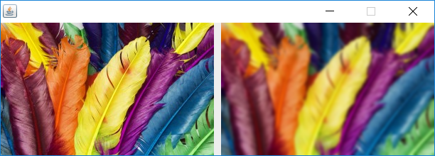

# Project 1: Image Processing

This is my implementation of the first project for CS61B Data Structures (Spring 2014).  There are two parts to this project.  The first is to implement two simple image processing operations on color images: blurring and edge detection.  Libraries are used to read and write files in the TIFF image format.  The second part is to
convert an image into a run-length encoding (compressed TIF file) and back.  See [readme.pdf](readme.pdf) or [readme.txt](readme.txt) for the full project description and requirements.

## Getting Started

These instructions will get you a copy of the project up and running on your local machine.

### Prerequisites

This project can be run with JDK 8.

### Installing

1. Clone the repository
2. Compile all the code like below on Windows from the root directory:

```
javac -cp "jai_core.jar;jai_codec.jar" *.java

```

## Blur

To blur an image, run Blur with the following classpath and parameters:

```
java -cp ".;jai_core.jar;jai_codec.jar" Blur {image_file_name} {number_of_iterations}
```

where
**{image_file_name}** is the name of the file
**{number_of_iterations}** (optional) specifies the number of blurring iterations to perform

For example, if you run:

```
java -cp ".;jai_core.jar;jai_codec.jar" Blur feathers.tiff 5
```

then Blur will load the image from baby.tiff, perform 5 iterations of blurring, write the blurred image to a file named blur_image.tiff, and display the input and output images side-by-side.  If **{number_of_iterations}** is omitted, the default number of iterations is 1.



## Edge Detection

To perform edge detection, run Sobel with the following classpath and parameters:

```
java -cp ".;jai_core.jar;jai_codec.jar" Sobel {image_file_name} {number_of_iterations}
```

where
**{image_file_name}** is the name of the file
**{number_of_iterations}** (optional) specifies the number of blurring iterations to perform before performing edge detection

For example, if you run:

```
java -cp ".;jai_core.jar;jai_codec.jar" Sobel baby.tiff 5
```

then Sobel will load the image from baby.tiff, perform 5 iterations of blurring, perform Sobel edge detection on the blurred image, write the blurred image to a file named blur_baby.tiff, write the grayscale-edge image to a file named edge_image.tiff, and display all three images (1 input, 2 output).  If **{number_of_iterations}** is omitted, no blurring is performed, and no blurred image is written nor displayed.


## Run-Length Encoding

To convert an input TIFF file to a run-length encoded TIFF file, simply pass three or more arguments to the Sobel program (doesn't matter what the third argument is).

For example, if you run:

```
java -cp ".;jai_core.jar;jai_codec.jar" Sobel baby.tiff 5 asdf
```

it will write the grayscale-edge image twice, once as an uncompressed TIFF file and once as a run-length encoded TIFF file.  The two tiff files will be different and have different lengths, but the images will be identical.  You can compare the sizes of the two TIFF files.  In this case, the uncompressed grayscale-edge image is 165KB while the compressed grayscale-edge image is 62KB.
