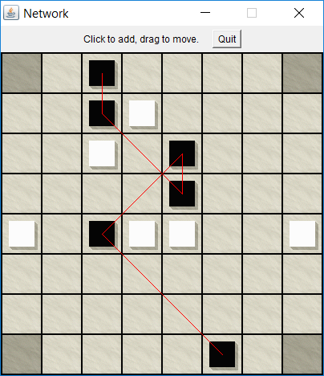

# Project 2: Network (The Game)

This is my implementation of the second project for CS61B Data Structures (Spring 2014).  The purpose of this project is to implement a computer player that plays the Network game against a human player or another computer player.  See [readme.pdf](readme.pdf) or [readme.txt](readme.txt) for the full project description and requirements.



## Getting Started

1. Clone the repository
2. Compile all the code like below on Windows from the root directory:

```
javac -cp ".;test-lib/*" player/*.java

```

3. Run Network with the following arguments from the root directory:

```
java Network {player1} {player2}
```

**{player1}** has the first turn and **{player2}** has the second turn.

A player can be one of the following:

```
machine
human
random
```

For example, the below arguments starts a game with the human player taking the first turn and machine player taking the second:

```
java Network human machine
```

### Prerequisites

Network can be run with JDK 8.

Python 3 is required if you want to run the [test.py](https://github.com/entomber/CS61B/blob/master/Project2/test.py) script.

### Test script

[test.py](https://github.com/entomber/CS61B/blob/master/Project2/test.py) script allows the user to run games of Network sequentially and in parallel for testing purposes.  The script outputs the number of wins for each player, the mean and median number of moves for a win, the top 5 most frequent moves made during wins, and total running time.

Format to call the script is below.

```
py test.py {player1} {player2} {games} {concurrent}
```

**{player1/player2}** = 'm' (machine) or 'r' (random)
**{games}** = number of total games
**{concurrent}** = number of games to run in parallel (recommended no more than number of logical processors), if blank it will run games amounting to number of logical cores in parallel (i.e. 4 logical cores = 4 games in parallel)

For example, the below arguments will play 2 machine players against each other, with 200 total games, running 4 games in parallel.

```
py test.py m m 200 4
```

### Unit tests

All unit tests within the project can be run like below:

```
java -cp ".;test-lib/*" org.junit.runner.JUnitCore player.AllTests
```

Check [AllTests.java](player/AllTests.java) for the test classes ran.